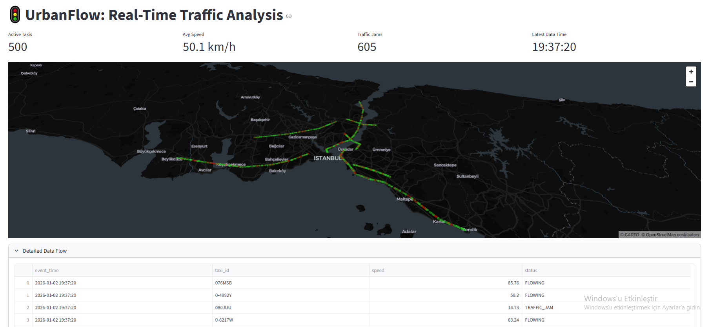

# UrbanFlow: Real-Time Traffic Data Pipeline

**UrbanFlow** is an end-to-end data engineering project that simulates, processes, and visualizes real-time traffic data in Istanbul. It demonstrates a complete Lambda Architecture using modern big data technologies.

    

## Architecture

The pipeline consists of four main stages:
1.  **Ingestion:** Python-based simulation generates realistic taxi location data on defined routes and pushes it to **Apache Kafka**.
2.  **Processing:** **Apache Spark Structured Streaming** consumes data from Kafka, processes micro-batches, and handles data enrichment.
3.  **Storage:** Processed geospatial data is stored in **PostgreSQL (PostGIS)**.
4.  **Visualization:** A real-time dashboard built with **Streamlit** & **PyDeck** monitors traffic density and anomalies.



```mermaid
graph LR
    A[Taxi Simulator] -->|JSON Stream| B(Apache Kafka)
    B -->|Micro-Batches| C{Spark Streaming}
    C -->|ETL| D[(PostgreSQL / PostGIS)]
    D -->|Query| E[Streamlit Dashboard]